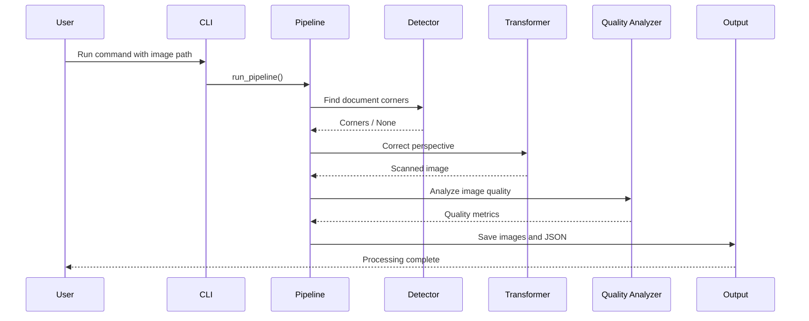

```mermaid
sequenceDiagram
    participant U as User
    participant C as CLI
    participant P as Pipeline
    participant D as Detector
    participant T as Transformer
    participant Q as Quality Analyzer
    participant O as Output

    U->>C: Run command with image path
    C->>P: run_pipeline()
    P->>D: Find document corners
    D-->>P: Corners / None
    P->>T: Correct perspective
    T-->>P: Scanned image
    P->>Q: Analyze image quality
    Q-->>P: Quality metrics
    P->>O: Save images and JSON
    O-->>U: Processing complete
```
