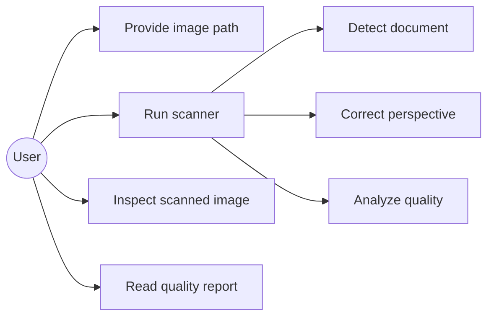

```mermaid
flowchart LR
    U((User)) --> UC1[Provide image path]
    U --> UC2[Run scanner]
    U --> UC3[Inspect scanned image]
    U --> UC4[Read quality report]
    UC2 --> UC5[Detect document]
    UC2 --> UC6[Correct perspective]
    UC2 --> UC7[Analyze quality]
```
