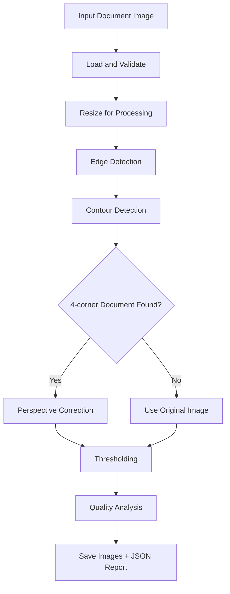

```mermaid
flowchart TD
    A[Input Document Image] --> B[Load and Validate]
    B --> C[Resize for Processing]
    C --> D[Edge Detection]
    D --> E[Contour Detection]
    E --> F{4-corner Document Found?}
    F -- Yes --> G[Perspective Correction]
    F -- No --> H[Use Original Image]
    G --> I[Thresholding]
    H --> I
    I --> J[Quality Analysis]
    J --> K[Save Images + JSON Report]
```
